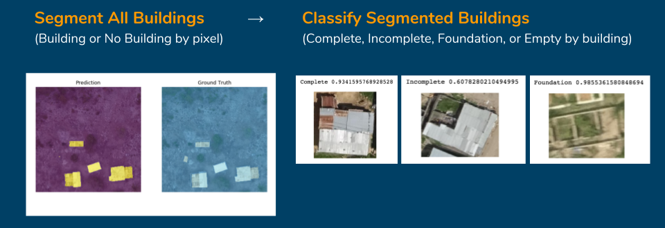
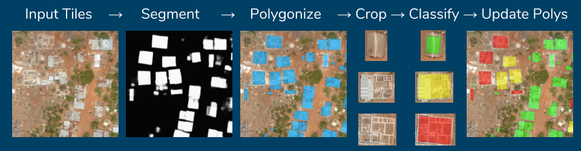

# Aerial Mapping with Drones & Deep Learning in Zanzibar, Tanzania

## Motivation:

Open source R&D notebooks of all the steps (deep learning and otherwise) to create a state of the art deep learning building detector & classifier from high-resolution aerial/drone imagery. Something like this: 

### Interactive version: [http://alpha.anthropo.co/znz-demo](http://alpha.anthropo.co/znz-demo)

## Results:

[Top 2 in WeRobotics' Open AI Tanzania Challenge](https://blog.werobotics.org/2018/12/06/announcing-the-winners-of-the-open-ai-tanzania-challenge/)

|                             | Mean F1 score | Foundation F1 | Unfinished F1 | Completed F1 | All Buildings F1 |
|-----------------------------|---------------|---------------|---------------|--------------|------------------|
| Final Test (grids 059, 066) | 0.697         | 0.744         | 0.692         | 0.655        | 0.723            |
| Internal Val (grid 042)     | 0.696         | 0.683         | 0.749         | 0.656        | 0.757            |

## Background:

https://blog.werobotics.org/2018/08/06/welcome-to-the-open-ai-tanzania-challenge/

> Maps are absolutely essential for decision support. Knowing where buildings are located is a fundamental input for urban planning, public safety, public health, disaster response, environmental protection, sustainable development and census data, for example. Some of these applications typically require timely and high-resolution maps.

> Take the following scenario: a local organization that provides low-cost solar panels to low-income households in rural Tanzania is evaluating a large neighborhood with many small houses. They have to determine how to best optimize the installation and distribution of their panels. So they need to know which of the residential structures are oriented in a way that makes them more suitable for solar panels. Knowing where these small houses are and what their orientation is vis-a-vis the sun and surrounding trees, what their roofs look like to determine where to place the panels, and what materials the roofs are made of are all key inputs for their planning. This is just one of many applications for high-resolution maps.

https://competitions.codalab.org/competitions/20100#learn_the_details
> Open AI Tanzania — is a partnership with our friends at the State University of Zanzibar (SUZA), WeRobotics, World Bank, OpenAerialMap and Tanzania Flying Labs. Open AI Tanzania invites data scientists to develop feature detection algorithms that can automatically identify buildings and building types using high-resolution aerial imagery collected by Tanzanian drone pilots through the Zanzibar Mapping Initiative (ZMI). The goal of this challenge is to correctly segment and classify building footprints under various stages of construction.

## Source imagery & training data license

> We request that all participants fill out a [Google Form](https://docs.google.com/forms/d/e/1FAIpQLSewpoY650nUHyl5kobIWl68Msk2QFBEC8XFCAV6lZSwbVdqUw/viewform).

> The imagery data is released as OpenData using the Creative Commons Attribution 4.0 International license, attribution must be given to: Commission for Lands (COLA), Revolutionary Government of Zanzibar (RGoZ)

## Overview:

### Training workflow:

### Prediction workflow:

## Current notebooks:

### [znz-segment-buildingfootprint-20181205-comboloss-rn34.ipynb](znz-segment-buildingfootprint-20181205-comboloss-rn34.ipynb)

- segmentation model for pixel-level mapping of every building structure, regardless of condition 
- combined BCE/dice loss function, pretrained resnet34 encoder
- dice: 0.854, accuracy: 98.2%

### [znz-classify-buildings-20181206.ipynb](znz-classify-buildings-20181206.ipynb)

- building classification by condition (Complete, Incomplete, Foundation, Empty) after detection/segmentation
- BCE loss, pretrained resnet50
- accuracy: 94%
- t-SNE and Grad-CAM demos
- prediction demo

## Ready-to-train preprocessed datasets

### [znz-segment-z19.zip](https://www.dropbox.com/s/v1zvgrv06alogkk/znz-segment-z19.zip?dl=0) (212 MB):

- 2,691 512x512 square image chips at zoom level 19 (~0.3m/pixel) as .jpg files with corresponding binary masks as .png files
- Unzips as znz-train-z19-all-buffered/images-512 and znz-train-z19-all-buffered/masks-512

### [znz-classify.zip](https://www.dropbox.com/s/9ge0a2kpuv0a0lk/znz-classify.zip?dl=0) (259 MB):  

- 20,176 images of various sizes & shapes labeled as 4 classes: Complete, Incomplete, Foundation, Empty
- Unzips as /images 
- 
## Thanks

- Commission for Lands (COLA), Revolutionary Government of Zanzibar (RGoZ)
- Zanzibar Mapping Initiative
- WeRobotics
- OpenAerialMap
- Fast.ai team and library v1
- Fast.ai forum participants and fellow students (particularly @KarlH, @henripal for code/nbs)

## TO DO

- [x] train segmentation model in fastai v1 up to prior performance level of dice = 0.847, accuracy = 0.977 from fastai v0.7
- [] training image mask/tile creation nb
- [] polygonization nb
- [] prediction thresholding and clean-up nb
